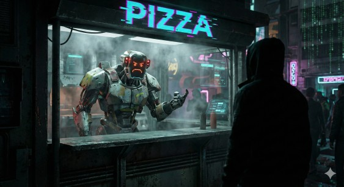

# Pizzageddon 2077: Kitchen Simulator

A high-concurrency microservice intended to demonstrate how to manage limited resources against a massive demand of starving citizens. 

## The Big Picture
The system is composed of two main components and an observability layer:

- **The Kitchen:** Receives orders via **gRPC**, pushes them to a *ticket rail*, and assigns them to a *worker pool* of futuristic ovens. It uses *PostgreSQL*.
- **The Blitz:**   A script that floods the server with thousands of requests to test its endurance and correctness despite a gazillion of concurrent orders.
- **The Watchtower:** Follows good observability standards by using *OpenTelemetry* and *Grafana*.

***  
